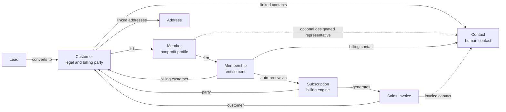
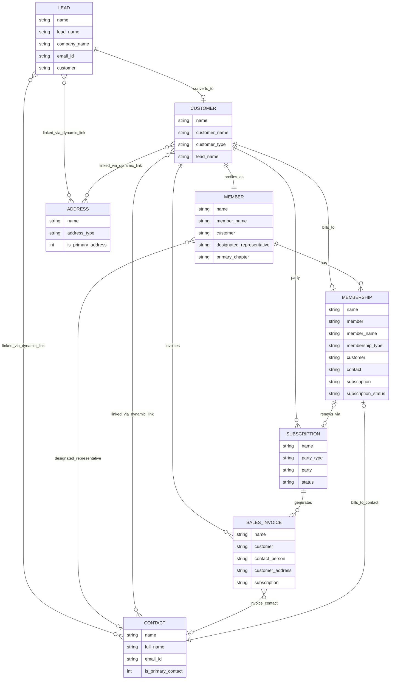

# Non Profit Relationship Diagram

## High-Level Refactored Model

This is the simplified business view of the current refactored model:

- `Customer` is the canonical legal and billing party.
- `Member` is the nonprofit profile of exactly one `Customer`.
- `Membership` belongs to a `Member`.
- `Contact` and `Address` stay attached to `Customer` through Frappe's dynamic linking model.
- `Subscription` and `Sales Invoice` remain the ERPNext billing objects.
- `Lead` is the prospect record and can convert into `Customer`.

### ASCII Overview

```text
                    +------------------+
                    |     Contact      |
                    |------------------|
                    | human contact    |
                    | is_primary...    |
                    +---------+--------+
                              ^
                              | Dynamic Link
                              |
+------------------+          |          +------------------+
|     Address      |----------+--------->|     Customer     |
|------------------| Dynamic Link        |------------------|
| billing/shipping |                     | legal/billing    |
+------------------+                     | party            |
                                         | customer_type    |
                                         +---------+--------+
                                                   ^
                                                   | 1:1
                                                   |
                                         +---------+--------+
                                         |      Member      |
                                         |------------------|
                                         | nonprofit profile|
                                         | member_name      |
                                         | derived          |
                                         | designated_rep ? |
                                         +---------+--------+
                                                   ^
                                                   | 1:n
                                                   |
                                         +---------+--------+
                                         |    Membership    |
                                         |------------------|
                                         | membership_type  |
                                         | billing customer |
                                         | billing contact  |
                                         | auto_renew       |
                                         | subscription     |
                                         +---------+--------+
                                                   |
                                                   | 0..1
                                                   v
                                         +---------+--------+
                                         |   Subscription   |
                                         |------------------|
                                         | party=Customer   |
                                         | plans/status     |
                                         +---------+--------+
                                                   |
                                                   | 1:n
                                                   v
                                         +------------------+
                                         |   Sales Invoice  |
                                         |------------------|
                                         | customer         |
                                         | contact_person   |
                                         | customer_address |
                                         | subscription     |
                                         +------------------+

Lead -> Customer conversion happens before this chain.
```



## Relationship Notes

- `Lead -> Customer`: conversion path from prospect to party record.
- `Customer -> Member`: 1:1 nonprofit profile relationship.
- `Member -> Membership`: one member can hold multiple memberships.
- `Customer -> Contact` and `Customer -> Address`: handled through Frappe `Dynamic Link` records.
- `Member -> Contact`: optional designated representative, mainly useful for organizations.
- `Membership -> Customer` and `Membership -> Contact`: explicit billing fields on the membership.
- `Membership -> Subscription -> Sales Invoice`: billing chain for renewals and invoices.
- `Sales Invoice -> Contact`: invoice-specific contact person, not ownership.

## Technical ER Diagram


